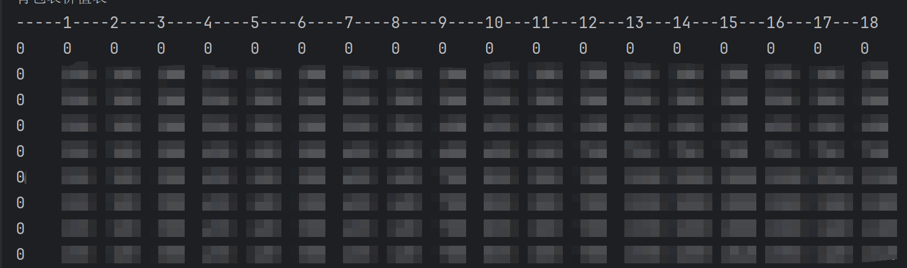
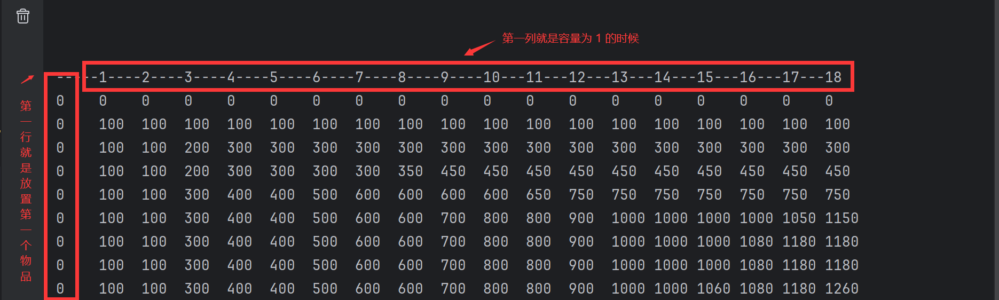

# 动态规划

#### 一、动态规划典型问题是背包问题，分为 01 背包和完全背包

```java
01 背包
    =》1.物品的重量 int[] weight = {1,3,5,3,6,4,7,5};
    =》2.物品的价值 int[] value = {100, 200, 150, 300, 400, 180, 320, 260};
    =》3.背包的容量 int capacity = 18;
    =》4.物品的个数 int number = value.length;
    也就是维护这两个数组
    
    // 在前 i 个物品中能够装入容量为 j 的最大价值
    int[][] maxValue = new int[number+1][capacity+1];
    // 为了记录在背包容量为某一个值的时候 => 放的商品的种类和个数
    int[][] path = new int[number+1][capacity+1];
```


maxValue （行为物品个数加一，列数为背包容量加一）的初始化结果为



第一行就是只有第一个物品，第一列就是容量最大只是一



```java
// 然后开始填表
for (int i = 1; i < maxValue.length; i++) {
    // 一行一行开始处理，外层循环一次就是处理一行，i 就是现在添加到的是第几个物品
    for (int j = 1; j < maxValue[0].length; j++) {
        // 对每一个 maxValue 进行处理，j 就是现在背包的容量是多少
        // 如果新出现的这个物品比目前的背包容量还大
        if (weight[i-1] > j) {
            // 那么这个容量下还是由前面哪些物品组成
            maxValue[i][j] = maxValue[i-1][j];
        } else {
            // 否则就比较该容量下使用原物品的最大值 ? 和新增加一个这中物品的最大值
            int orgin = maxValue[i-1][j];
            int now = maxValue[i-1][j-weight[i-1]] + value[i-1];
            if (orgin > now) {
                // 不采用这个新的物品
                maxValue[i][j] = orgin;
            } else {
                // 采用，放一个这种新的物品
                maxValue[i][j] = now;
                // 放了就记录
                path[i][j] = 1;
            }
        }
    }
}

```

