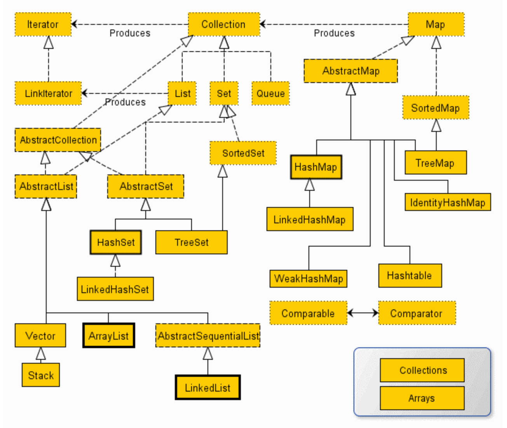

# 集合

```java
Java集合框架体系（java.util包下）
java.util.Collection:存储一个一个的数据
    |-----子接口：List:存储有序的、可重复的数据 ("动态"数组)
           |---- ArrayList(主要实现类)、LinkedList、Vector
	
    |-----子接口：Set:存储无序的、不可重复的数据(高中学习的集合)
           |---- HashSet(主要实现类)、LinkedHashSet、TreeSet


java.util.Map:存储一对一对的数据(key-value键值对，(x1,y1)、(x2,y2) --> y=f(x),类似于高中的函数)
    |---- HashMap(主要实现类)、LinkedHashMap、TreeMap、Hashtable、Properties
```



> Collection 接口的源码，不实现具体的实现，由其具体实现类去实现细节

```java
public interface Collection<E> extends Iterable<E> {
    int size();获取当前集合中实际存储的元素个数
    boolean isEmpty();判断当前集合是否为空集合
    boolean contains(Object o);判断当前集合中是否存在一个与obj对象equals返回true的元素
    Iterator<E> iterator();返回迭代器对象，用于集合遍历
    Object[] toArray();返回包含当前集合中所有元素的数组  Arrays.asList()返回一个固定长度的list
    <T> T[] toArray(T[] a);
    default <T> T[] toArray(IntFunction<T[]> generator) {
        return toArray(generator.apply(0));
    }
    boolean add(E e);添加元素对象到当前集合中
    boolean remove(Object o);从当前集合中删除第一个找到的与obj对象equals返回true的元素。
	boolean containsAll(Collection<?> c);判断coll集合中的元素是否在当前集合中都存在。即coll集合是否是当前集合的“子集”
    boolean addAll(Collection<? extends E> c);添加other集合中的所有元素对象到当前集合中，即this = this ∪ other
    boolean removeAll(Collection<?> c);从当前集合中删除所有与coll集合中相同的元素。即this = this - this ∩ coll
    default boolean removeIf(Predicate<? super E> filter) {
        Objects.requireNonNull(filter);
        boolean removed = false;
        final Iterator<E> each = iterator();
        while (each.hasNext()) {
            if (filter.leetcode.leetcode(each.next())) {
                each.remove();
                removed = true;
            }
        }
        return removed;
    }
    boolean retainAll(Collection<?> c);从当前集合中删除两个集合中不同的元素，使得当前集合仅保留与coll集合中的元素相同的元										 素，即当前集合中仅保留两个集合的交集，即this  = this ∩ coll；
    void clear();清空集合元素
    boolean equals(Object o);判断当前集合与obj是否相等
    int hashCode();获取集合对象的哈希值
    @Override
    default Spliterator<E> spliterator() {
        return Spliterators.spliterator(this, 0);
    }
    default Stream<E> stream() {
        return StreamSupport.stream(spliterator(), false);
    }
    default Stream<E> parallelStream() {
        return StreamSupport.stream(spliterator(), true);
    }
}
```

> iterator 接口的源码

```java
public interface Iterator<E> {
    boolean hasNext();
    E next();
    default void remove() {
        throw new UnsupportedOperationException("remove");
    }
    default void forEachRemaining(Consumer<? super E> action) {
        Objects.requireNonNull(action);
        while (hasNext())
            action.accept(next());
    }
}
```

> ListIterator 接口的源码

```java
public interface ListIterator<E> extends Iterator<E> {
    boolean hasNext();如果仍有元素可以迭代，则返回 true。
    E next();返回迭代的下一个元素	
    boolean hasPrevious();
    E previous();
    int nextIndex();
    int previousIndex();
    void remove();//此remove之前可以进行条件判定
    void set(E e);
    void add(E e);
}
```

> 下面是一些关于 iterator 遍历的操作

```java

Iterator iterator = coll.iterator();//获取迭代器对象
while(iterator.hasNext()) {//判断是否还有元素可迭代
    System.out.println(iterator.next());//取出下一个元素
}

Iterator iterator = coll.iterator();
while(iterator.hasNext()){
    Integer element = (Integer) iterator.next();
    if(element % 2 == 0){
        iterator.remove();
    }
}
- Iterator可以删除集合的元素，但是遍历过程中通过迭代器对象的remove方法，不是集合对象的remove方法。
- 如果还未调用next()或在上一次调用 next() 方法之后已经调用了 remove() 方法，再调用remove()都会报IllegalStateException。
- Collection已经有remove(xx)方法了，为什么Iterator迭代器还要提供删除方法呢？因为迭代器的remove()可以按指定的条件进行删除。

 coll.removeIf(new Predicate() {
     @Override
     public boolean leetcode.leetcode(Object o) {
         String str = (String) o;
         return str.contains("地");``
     }
 });
```

> 下面是关于增强for循环的介绍

```java
for(元素的数据类型 局部变量 : Collection集合或数组){ 
  	//操作局部变量的输出操作
}
增强 for 循环的底层使用的就是 iterator 接口中的 iterator()方法
    首先，当且仅当 一个类实现了 Iterable 接口时，它才能使用该语法糖。
    如果一个类未实现 Iterable 接口，而对其使用该语法糖，则编译时报错：foreach not applicable to type 'java.lang.String'
```

> ArrayList类中有两个关于 iterator 的内部类

```java
public ListIterator<E> listIterator() {
    return new ListItr(0);
}

public Iterator<E> iterator() {
    return new Itr();
}

private class Itr implements Iterator<E> {
    int cursor;       // index of next element to return
    int lastRet = -1; // index of last element returned; -1 if no such
    int expectedModCount = modCount;

    Itr() {}

    public boolean hasNext() {
        return cursor != size;
    }

    @SuppressWarnings("unchecked")
    public E next() {
        checkForComodification();
        int i = cursor;
        if (i >= size)
            throw new NoSuchElementException();
        Object[] elementData = ArrayList.this.elementData;
        if (i >= elementData.length)
            throw new ConcurrentModificationException();
        cursor = i + 1;
        return (E) elementData[lastRet = i];
    }

    public void remove() {
        if (lastRet < 0)
            throw new IllegalStateException();
        checkForComodification();

        try {
            ArrayList.this.remove(lastRet);
            cursor = lastRet;
            lastRet = -1;
            expectedModCount = modCount;
        } catch (IndexOutOfBoundsException ex) {
            throw new ConcurrentModificationException();
        }
    }

    @Override
    @SuppressWarnings("unchecked")
    public void forEachRemaining(Consumer<? super E> consumer) {
        Objects.requireNonNull(consumer);
        final int size = ArrayList.this.size;
        int i = cursor;
        if (i >= size) {
            return;
        }
        final Object[] elementData = ArrayList.this.elementData;
        if (i >= elementData.length) {
            throw new ConcurrentModificationException();
        }
        while (i != size && modCount == expectedModCount) {
            consumer.accept((E) elementData[i++]);
        }
        // update once at end of iteration to reduce heap write traffic
        cursor = i;
        lastRet = i - 1;
        checkForComodification();
    }

    final void checkForComodification() {
        if (modCount != expectedModCount)
            throw new ConcurrentModificationException();
    }
}

/**
 * An optimized version of AbstractList.ListItr
 */
private class ListItr extends Itr implements ListIterator<E> {
    ListItr(int index) {
        super();
        cursor = index;
    }

    public boolean hasPrevious() {
        return cursor != 0;
    }

    public int nextIndex() {
        return cursor;
    }

    public int previousIndex() {
        return cursor - 1;
    }

    @SuppressWarnings("unchecked")
    public E previous() {
        checkForComodification();
        int i = cursor - 1;
        if (i < 0)
            throw new NoSuchElementException();
        Object[] elementData = ArrayList.this.elementData;
        if (i >= elementData.length)
            throw new ConcurrentModificationException();
        cursor = i;
        return (E) elementData[lastRet = i];
    }

    public void set(E e) {
        if (lastRet < 0)
            throw new IllegalStateException();
        checkForComodification();

        try {
            ArrayList.this.set(lastRet, e);
        } catch (IndexOutOfBoundsException ex) {
            throw new ConcurrentModificationException();
        }
    }

    public void add(E e) {
        checkForComodification();

        try {
            int i = cursor;
            ArrayList.this.add(i, e);
            cursor = i + 1;
            lastRet = -1;
            expectedModCount = modCount;
        } catch (IndexOutOfBoundsException ex) {
            throw new ConcurrentModificationException();
        }
    }
}
```

> ```java
> List及其实现类特点 （List集合类中`元素有序`、且`可重复`，集合中的每个元素都有其对应的顺序索引）
> java.util.Collection:存储一个一个的数据
>     |-----子接口：List:存储有序的、可重复的数据 ("动态"数组)
>            |---- ArrayList:List的主要实现类；线程不安全的、效率高；底层使用Object[]数组存储
>                            在添加数据、查找数据时，效率较高；在插入、删除数据时，效率较低
>            |---- LinkedList:底层使用双向链表的方式进行存储；在对集合中的数据进行频繁的删除、插入操作时，建议使用此类
>                            在插入、删除数据时，效率较高；在添加数据、查找数据时，效率较低；
>            |---- Vector:List的古老实现类；线程安全的、效率低；底层使用Object[]数组存储
>            
> 相比于 Colection 接口，List 接口中添加了一些利用索引来操作数据集合的办法
>     增
>         add(Object obj)
>         addAll(Collection coll)
>     删
>         remove(Object obj)
>         remove(int index)
>     改
>         set(int index, Object ele)
>     查
>         get(int index)
>     插
>         add(int index, Object ele)
>         addAll(int index, Collection eles)
>     长度
>         size()
>     遍历
>         iterator() ：使用迭代器进行遍历
>         增强for循环
>         普通for循环
> ```

> 下面是 List 源码，添加了一些利用索引（index）来操作数据集合

```java
public interface List<E> extends Collection<E> {
    int size();
    boolean isEmpty();
    boolean contains(Object o);
    Iterator<E> iterator();
    Object[] toArray();
    <T> T[] toArray(T[] a);
    boolean add(E e);
    boolean remove(Object o);
    boolean containsAll(Collection<?> c);
    boolean addAll(Collection<? extends E> c);
    boolean addAll(int index, Collection<? extends E> c);
    boolean removeAll(Collection<?> c);
    boolean retainAll(Collection<?> c);
    default void replaceAll(UnaryOperator<E> operator) {
        Objects.requireNonNull(operator);
        final ListIterator<E> li = this.listIterator();
        while (li.hasNext()) {
            li.set(operator.apply(li.next()));
        }
    }
    default void sort(Comparator<? super E> c) {
        Object[] a = this.toArray();
        Arrays.sort(a, (Comparator) c);
        ListIterator<E> i = this.listIterator();
        for (Object e : a) {
            i.next();
            i.set((E) e);
        }
    }
    void clear();
    boolean equals(Object o);
    int hashCode();
    E get(int index);
    E set(int index, E element);
    void add(int index, E element);
    E remove(int index);
    int indexOf(Object o);
    int lastIndexOf(Object o);
    ListIterator<E> listIterator();
    ListIterator<E> listIterator(int index);
    List<E> subList(int fromIndex, int toIndex);
    @Override
    default Spliterator<E> spliterator() {
        return Spliterators.spliterator(this, Spliterator.ORDERED);
    }
}
```

> ArrayList 的源码解析
>
> [ArrayList源码全面解析_arraylist源码分析-CSDN博客](https://blog.csdn.net/weixin_43759352/article/details/134675709)
>
> 

```java
```

> LinkedList 双向链表存储
>
> - void addFirst(Object obj)
> - void addLast(Object obj)	
> - Object getFirst()
> - Object getLast()
> - Object removeFirst()
> - Object removeLast()

```java
```

> Vector 是一个`古老`的集合，JDK1.0就有了。大多数操作与ArrayList相同，区别之处在于Vector是`线程安全`的。
>
> 在各种List中，最好把`ArrayList作为默认选择`。当插入、删除频繁时，使用LinkedList；Vector总是比ArrayList慢，所以尽量避免使用。
>
> 特有方法：
>
> - void addElement(Object obj)
> - void insertElementAt(Object obj,int index)
> - void setElementAt(Object obj,int index)
> - void removeElement(Object obj)
> - void removeAllElements()


## Collection子接口2：Set
