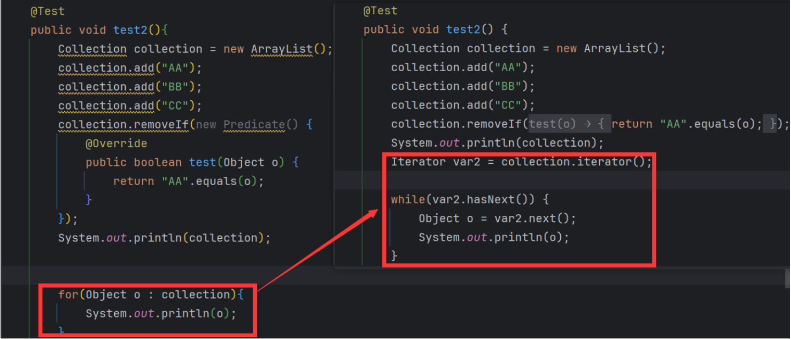

```java
Iterator iterator = coll.iterator();//获取迭代器对象
while(iterator.hasNext()) { //判断是否还有元素可迭代
    System.out.println(iterator.next());//取出下一个元素
}

Iterator iterator = coll.iterator();
while(iterator.hasNext()){
    Integer element = (Integer) iterator.next();
    if(element % 2 == 0){
        iterator.remove();
    }
}
- Iterator可以删除集合的元素，但是遍历过程中通过迭代器对象的remove方法，不是集合对象的remove方法。
- 如果还未调用next()或在上一次调用 next() 方法之后已经调用了remove()方法，再调用remove()都会报 IllegalStateException。
- Collection已经有remove(xx)方法了，为什么Iterator迭代器还要提供删除方法呢？因为迭代器的remove()可以按指定的条件进行删除。

 coll.removeIf(new Predicate() {
     @Override
     public boolean test(Object o) {
         String str = (String) o;
         return str.contains("地");``
     }
 });
```

> 下面是关于增强for循环的介绍

```java
for(元素的数据类型 局部变量 : Collection集合或数组){ 
  	//操作局部变量的输出操作
}
增强 for 循环的底层使用的就是 iterator 接口中的 iterator()方法
    首先，当且仅当 一个类实现了 Iterable 接口时，它才能使用该语法糖。
    如果一个类未实现 Iterable 接口，而对其使用该语法糖，则编译时报错：foreach not applicable to type 'java.lang.String'
```

> 增强 for 循环的底层原理如下：

> 将源码生成的字节码反编译可以看到：


