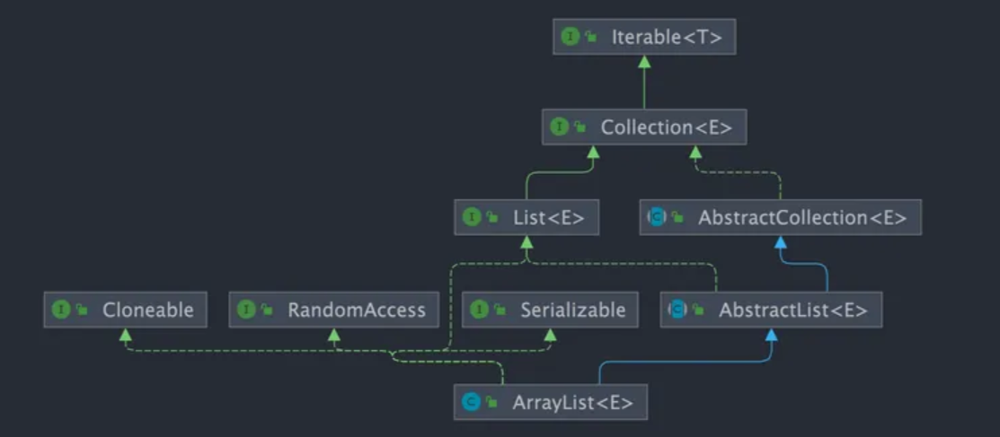
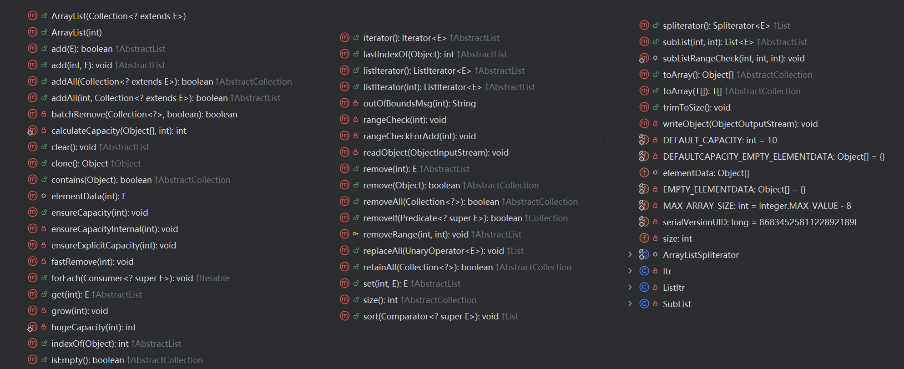

# ArrayList1.7源码分析



> ArrayList 源码中的属性

```java
public class ArrayList<E> extends AbstractList<E> 
        implements List<E>, RandomAccess, Cloneable, java.io.Serializable
{
    //Serializable接口给需要序列化的类，提供了一个序列版本号：serialVersionUID。凡是实现Serializable接口的类都应该有一个表示序列化版本标识符的静态变量，它的值由程序员随意指定即可。
    private static final long serialVersionUID = 8683452581122892189L;
    private transient Object[] elementData;//存储底层数组元素
    private int size;//记录数组中存储的元素的个数，初始化的值为 0
    protected transient int modCount = 0;//记录对List进行操作的次数
    // 一些虚拟机会预留数组头部的大小，一般数组头部有8个字节，所以 这里要减掉头部的8个字节，不然的话，整个数组大小就超过int的最大值了。就会跑出OutOfMemoryError错误。
    private static final int MAX_ARRAY_SIZE = Integer.MAX_VALUE - 8;
    (Integer中 public static final int  MAX_VALUE = 0x7fffffff;)
}
```

> ArrayList 的构造方法有以下几种

```java
//构造具有指定初始容量的空列表。Params： initialCapacity – 列表的初始容量 
//Throws： IllegalArgumentException – 如果指定的初始容量为负数
public ArrayList(int initialCapacity) {
    super();
    if (initialCapacity < 0)
        throw new IllegalArgumentException("Illegal Capacity: "+ initialCapacity);
    this.elementData = new Object[initialCapacity];
}
//构造一个初始容量为 10 的空列表。
public ArrayList() {
    //如果调用无参构造器，那么该构造器会调用上面的一个参数的构造器
    this(10);
}
//构造一个列表，其中包含指定集合的元素，按集合的迭代器返回的顺序排列。Params： c – 其元素将被放入此列表中的集合 
//Throws： NullPointerException – 如果指定的集合为 null
public ArrayList(Collection<? extends E> c) {
    elementData = c.toArray();
    size = elementData.length;
    // c.toArray might (incorrectly) not return Object[] (see 6260652)
    if (elementData.getClass() != Object[].class)
        elementData = Arrays.copyOf(elementData, size, Object[].class);
}
```


```java
000000000001   ArrayList<String> list = new ArrayList<>(); 在执行这句代码的时候，会调用 ArrayList 的无参构造器，继			   而调用传递 public ArrayList(int initialCapacity) 一个参数的构造器，然后初始化 elementData[]
    		   this.elementData = new Object[initialCapacity];
```

```java
000000000002   list.add("helloworld");
			   在调用这句话的时候会调用 ArrayList 的 add() 方法。
```

```java
public boolean add(E e) {
    // size 此时还没有赋值，初始化的值为0
    ensureCapacityInternal(size + 1);  // Increments modCount!!
    elementData[size++] = e;
    return true;
}
```

```java
private void ensureCapacityInternal(int minCapacity) {// 传值过来的是 size+1 即为 0+1
    modCount++;
    // overflow-conscious code  如果 arraylist 中实际存储的元素 + 1 > 数组长度length，就扩容 grow()，否则就什么都不做
    if (minCapacity - elementData.length > 0)
        grow(minCapacity);
}
```

```java
.......
000000000013   list.add("helloworld"); 
			   这是向 arraylist 集合中 add 的第11个元素，此时 size+1=11 > elementData.length，发生扩容，add()调用ensureCapacityInternal(int minCapacity)方法，继而调用grow(int minCapacity)方法
```

```java
private void grow(int minCapacity) {//传过来的是 size + 1
    // overflow-conscious code
    int oldCapacity = elementData.length;// 旧的数组的长度
    int newCapacity = oldCapacity + (oldCapacity >> 1);// 设置新的数组的长度为旧数组长度的1.5倍
    if (newCapacity - minCapacity < 0)// 如果新的数组长度仍然小于添加元素后的元素个数就把元素个数作为新数组长度
        newCapacity = minCapacity;
    if (newCapacity - MAX_ARRAY_SIZE > 0)// 如果新的数组长度大于 MAX_ARRAY_SIZE=0x7fffffff - 8
        newCapacity = hugeCapacity(minCapacity);                            =2,147,483,647 - 8
    // minCapacity is usually close to size, so this is a win:
    elementData = Arrays.copyOf(elementData, newCapacity);
}
```

```java
private static int hugeCapacity(int minCapacity) {
    // 例如：newCapacity = 24亿，minCapacity = 18亿, renturn MAX_ARRAY_SIZE;
    // 例如：newCapacity = 24亿，minCapacity = 22亿, renturn Integer.MAX_VALUE;
    if (minCapacity < 0) // overflow
        throw new OutOfMemoryError();
    return (minCapacity > MAX_ARRAY_SIZE) ? Integer.MAX_VALUE : MAX_ARRAY_SIZE;
}
```


# ArrayList1.8源码分析

> ArrayList 源码中的属性

```java
public class ArrayList<E> extends AbstractList<E>
        implements List<E>, RandomAccess, Cloneable, java.io.Serializable
{
    private static final long serialVersionUID = 8683452581122892189L;
    private static final int DEFAULT_CAPACITY = 10;
    // 定义了一个数组，用于用户在初始化代码的时候传入容量为 0 时使用
    private static final Object[] EMPTY_ELEMENTDATA = {};
    // 定义了一个空的数组，用于在默认构造器中，赋值给顶级数组 elementData
    private static final Object[] DEFAULTCAPACITY_EMPTY_ELEMENTDATA = {};
    transient Object[] elementData; // non-private to simplify nested class access
    private int size;//The size of the ArrayList (the number of elements it contains).
    protected transient int modCount = 0;//记录对List进行操作的次数
    private static final int MAX_ARRAY_SIZE = Integer.MAX_VALUE - 8;
```

> ArrayList 的构造方法有以下几种

```java
// 无参构造器
public ArrayList() {
    this.elementData = DEFAULTCAPACITY_EMPTY_ELEMENTDATA; // {}
}
// 指定初始容量的构造器
public ArrayList(int initialCapacity) {
    if (initialCapacity > 0) {
        this.elementData = new Object[initialCapacity];
    } else if (initialCapacity == 0) {
        this.elementData = EMPTY_ELEMENTDATA;// {}
    } else {
        throw new IllegalArgumentException("Illegal Capacity: "+
                                           initialCapacity);
    }
}
// 传入 Collection 集合的构造器
// 将传入的集合转化为数组，赋值给elementData，并计算集合的大小size；
// 若 size != 0，判断该数组的类型和 ArrayList 的类型，若一致就把数组赋值给elementData，
//   											否则就拷贝一个 Object[] 类型的数组赋值给elementData
// 若size == 0，将 elementData 赋值为 EMPTY_ELEMENTDATA。
// 注：若传入的c为null，将会报空指针异常。
public ArrayList(Collection<? extends E> c) {
    Object[] a = c.toArray();
    if ((size = a.length) != 0) {
        if (c.getClass() == ArrayList.class) {
            elementData = a;
        } else {
            elementData = Arrays.copyOf(a, size, Object[].class);
        }
    } else {
        // replace with empty array.
        elementData = EMPTY_ELEMENTDATA;
    }
}
```

```java
000000000001   ArrayList<String> list = new ArrayList<>(); 在执行这句代码的时候，会调用 ArrayList 的无参构造器，把数组初始化为一个长度为0的数组
    this.elementData = DEFAULTCAPACITY_EMPTY_ELEMENTDATA; // {}
```

```java
000000000002   list.add("helloworld");
			   在调用这句话的时候会调用 ArrayList 的 add() 方法。
```

```java
public boolean add(E e) {
    // 传入当前的元素个数 + 1；首次传递 size 还没有初始化，值还是默认值0
    ensureCapacityInternal(size + 1);  // Increments modCount!!
    elementData[size++] = e;
    return true;
}
```

```java
private void ensureCapacityInternal(int minCapacity) { // size + 1
    ensureExplicitCapacity(calculateCapacity(elementData, minCapacity));
}
```

```java
private static int calculateCapacity(Object[] elementData, int minCapacity) { // {}  size + 1
    // 如果 elementData 是通过无参构造器构造的，return max(10, 首次add的元素个数)
    if (elementData == DEFAULTCAPACITY_EMPTY_ELEMENTDATA) {
        return Math.max(DEFAULT_CAPACITY, minCapacity);
    }
    return minCapacity;
}
```

```java
private void ensureExplicitCapacity(int minCapacity) { // 传入max(10, 首次add的元素个数)
                                                       // add()的话为10，addAll()可能为10，也可能大于10
    modCount++;
    // overflow-conscious code  判断是否要进行扩容，如果 minCapacity > elementData.length => 扩容，否则什么都不做
    if (minCapacity - elementData.length > 0)
        grow(minCapacity);
}
```

```java
private void grow(int minCapacity) {
    // overflow-conscious code
    int oldCapacity = elementData.length;
    int newCapacity = oldCapacity + (oldCapacity >> 1); // 设置新的数组的长度为旧数组长度的1.5倍
    if (newCapacity - minCapacity < 0)
        newCapacity = minCapacity; // 如果新的数组长度仍然小于添加元素后的元素个数就把元素个数作为新数组长度
    if (newCapacity - MAX_ARRAY_SIZE > 0)
        newCapacity = hugeCapacity(minCapacity);
    // minCapacity is usually close to size, so this is a win:
    elementData = Arrays.copyOf(elementData, newCapacity);
}

private static int hugeCapacity(int minCapacity) {
    if (minCapacity < 0) // overflow
        throw new OutOfMemoryError();
    return (minCapacity > MAX_ARRAY_SIZE) ? Integer.MAX_VALUE : MAX_ARRAY_SIZE;
}
```


> 1.8中 ArrayList 中的 addAll() 方法的源码分析

```java
public boolean addAll(Collection<? extends E> c) {
    Object[] a = c.toArray();
    int numNew = a.length;
    ensureCapacityInternal(size + numNew);  // Increments modCount
    System.arraycopy(a, 0, elementData, size, numNew);
    size += numNew;
    return numNew != 0;
}
Collection => 数组 => 进行扩容判断(数组.length + size) => 数组的拷贝
```

> 获取 ArrayList 的大小

```java
public int size() {
    return size;
}
```

> 判断 ArrayList 是否是空的

```java
public boolean isEmpty() {
    return size == 0;
}
```

> 获取元素的位置（第一次 => indexOf     最后一次 => lastIndexOf）

**循环遍历 elementData[] 判断其位置，返回下标，没有找到 return -1**

```java
public int indexOf(Object o) {
    if (o == null) {
        for (int i = 0; i < size; i++)
            if (elementData[i]==null)
                return i;
    } else {
        for (int i = 0; i < size; i++)
            if (o.equals(elementData[i]))
                return i;
    }
    return -1;
}
```

> lastIndexOf(Object o)

**从后往前循环遍历 elementData[] 判断其位置，返回下标，没有找到 return -1**

```java
public int lastIndexOf(Object o) {
    if (o == null) {
        for (int i = size-1; i >= 0; i--)
            if (elementData[i]==null)
                return i;
    } else {
        for (int i = size-1; i >= 0; i--)
            if (o.equals(elementData[i]))
                return i;
    }
    return -1;
}
```

> 判断是否包含某一个元素 contains

**调用 indexOf() 的返回值如果不是负数则证明有该值**

```java
public boolean contains(Object o) {
    return indexOf(o) >= 0;
}
```

> 给某一个位置设置元素

```java
public E set(int index, E element) {
    // 检查索引位置是否越界
    rangeCheck(index);
    // 查看底层elementData[]数组的某一个元素，将其替换为传入的 element，返回旧的元素
    E oldValue = elementData(index);
    elementData[index] = element;
    return oldValue;
}

private void rangeCheck(int index) {
    if (index >= size)
        throw new IndexOutOfBoundsException(outOfBoundsMsg(index));
}
private String outOfBoundsMsg(int index) {
    return "Index: "+index+", Size: "+size;
}
```

> 在指定的位置添加新的元素

```java
public void add(int index, E element) {
    // 范围检查
    rangeCheckForAdd(index);

    ensureCapacityInternal(size + 1);  // Increments modCount!!
    System.arraycopy(elementData, index, elementData, index + 1,
                     size - index);
    // 进行数组数组elementData元素的移动，最后把要添加的元素添加到指定的位置，然后进行元素个数size的累加
    elementData[index] = element;
    size++;
}

private void rangeCheckForAdd(int index) {
    if (index > size || index < 0)
        throw new IndexOutOfBoundsException(outOfBoundsMsg(index));
}
```

> 移除指定位置的元素

```java
// 移除指定位置的元素
public E remove(int index) {
    // 范围检查
    rangeCheck(index);

    modCount++;
    E oldValue = elementData(index);

    int numMoved = size - index - 1;
    if (numMoved > 0)
        System.arraycopy(elementData, index+1, elementData, index,
                         numMoved);
    elementData[--size] = null; // clear to let GC do its work

    return oldValue;
}

private void rangeCheck(int index) {
    if (index >= size)
        throw new IndexOutOfBoundsException(outOfBoundsMsg(index));
}

在移动元素的时候，仍然选择进行数组的拷贝。首先计算需要移动的元素个数（size - index - 1）；如果移动的元素的个数大于0，下面进行数组的拷贝（其实就是起到了移动元素的功能）；否则的话直接在elementData[-–size]处设置为空就可以了。记住最后需要返回移除了的值。
```

> 移除指定值的元素

```java
// 移除指定值的元素
public boolean remove(Object o) {
        if (o == null) {
            for (int index = 0; index < size; index++)
                if (elementData[index] == null) {
                    fastRemove(index);
                    return true;
                }
        } else {
            for (int index = 0; index < size; index++)
                if (o.equals(elementData[index])) {
                    fastRemove(index);
                    return true;
                }
        }
        return false;
    }

// fastRemove方法
 private void fastRemove(int index) {
     modCount++;
     int numMoved = size - index - 1;
     if (numMoved > 0)
         System.arraycopy(elementData, index+1, elementData, index,
                          numMoved);
     elementData[--size] = null; // clear to let GC do its work
 }

该方法对传入的参数进行是否为null的判断，两种情况下，对elementData数组进行循环遍历判断，是否与传入的值相等，相等的话调用fastRemove方法 进行元素的移除操作。
```





```java
Java中MAX_ARRAY_SIZE的值为Integer.MAX_VALUE - ，这是因为一些JVM（Java虚拟机）在数组中预留了一些头部信息，这些信息占据了8个字节的空间。为了避免内存溢出错误（OutOfMemoryError），数组的最大容量被设定为Integer.MAX_VALUE减去这8个字节的空间。

在Java中，数组对象的形状和结构与标准Java对象类似，但它们有一个额外的元数据部分，用于表示数组的大小。这个元数据部分包括类信息、标志集合（如对象的散列码以及对象的形状）、同步信息等，总共需要8个字节的存储空间。因此，为了确保整个数组（包括元数据和实际数据）的大小不会超过int类型的最大值，即Integer.MAX_VALUE，数组的最大容量被设定为Integer.MAX_VALUE减去这8个字节，即Integer.MAX_VALUE - 8。

此外，在ArrayList的实现中，如果尝试分配的容量超过MAX_ARRAY_SIZE，则会引发OutOfMemoryError。这是为了防止用户请求的数组大小超过JVM的限制，从而避免内存溢出错误。因此，了解MAX_ARRAY_SIZE的限制对于合理使用Java的数组和集合类是非常重要
```

