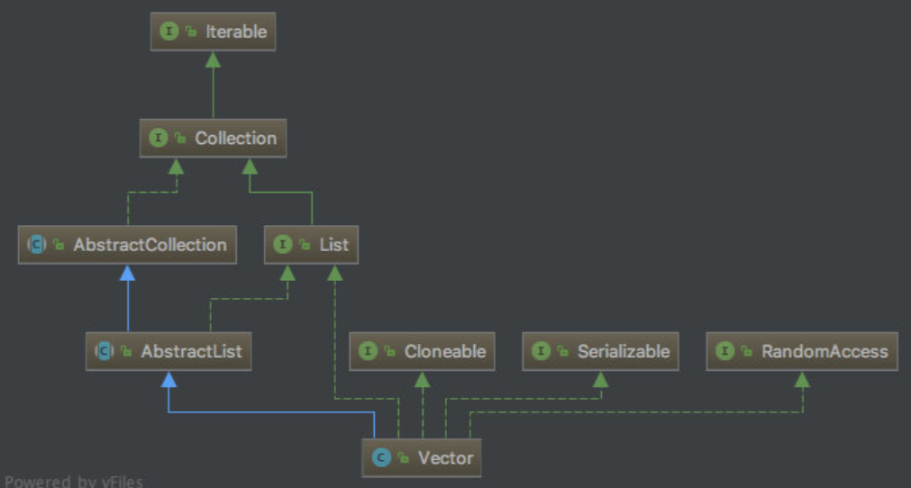

## Vector 1.8 源码分析



> Vector 源码中的属性

```java
public class Vector<E>
    extends AbstractList<E>
    implements List<E>, RandomAccess, Cloneable, java.io.Serializable
{
	protected Object[] elementData;// 用于存储元素底层的数组
    protected int elementCount;// 记录存储的元素个数
    protected int capacityIncrement;// 当vector的大小大于其容量时，其容量自动增加的量。如果容量增量小于或等于零，则每次需										  要增长时，向量的容量都会增加一倍。
    private static final long serialVersionUID = -2767605614048989439L;// 序列化版本号
    private static final int MAX_ARRAY_SIZE = Integer.MAX_VALUE - 8;// 最大的容量
}
```

> Vector 源码中的构造方法

```java
// 无参构造=>构造一个空vector，其内部数据数组的大小为{@code 10}，其标准容量增量为零。
public Vector() {
    this(10);
}
// 有参构造=>构造一个具有指定初始容量，且容量增量为零的空容器
public Vector(int initialCapacity) {
    this(initialCapacity, 0);
}
// 构造一个空容器，具有指定的初始容量和容量增量
public Vector(int initialCapacity, int capacityIncrement) {
    super();
    if (initialCapacity < 0)
        throw new IllegalArgumentException("Illegal Capacity: "+ initialCapacity);
    this.elementData = new Object[initialCapacity];
    this.capacityIncrement = capacityIncrement;
}
// 构造一个包含指定集合元素的vector，按集合迭代器返回的顺序排列
public Vector(Collection<? extends E> c) {
    Object[] a = c.toArray();
    elementCount = a.length;
    if (c.getClass() == ArrayList.class) {
        elementData = a;
    } else {
        elementData = Arrays.copyOf(a, elementCount, Object[].class);
    }
}
```


```java
000000000001   Vector vector = new Vector();
			   初始化底层数组长度为10，public Vector() => public Vector(int initialCapacity) 
                   		        => public Vector(int initialCapacity, int capacityIncrement)
```

```java
               this.elementData = new Object[initialCapacity];
               即为：Object[] elementData = new Object[10];// 此时其 capacityIncrement 的值是 0 
```

```java
000000000001   v.add("AA");
```

```java
public synchronized boolean add(E e) {
    // 记录集合被修改的次数
    modCount++;
    // 判断是否需要扩容
    ensureCapacityHelper(elementCount + 1);
    // 将传递进来的元素添加到数组的末尾
    elementData[elementCount++] = e;
    return true;
}
```

```java
private void ensureCapacityHelper(int minCapacity) { // 传递过来的值是元素个数 + 1
    // overflow-conscious code
    // 当实际需要的数组长度 - 数组实际的长度大于0时，表示需要进行扩容
    if (minCapacity - elementData.length > 0)
        grow(minCapacity);
}
```

```java
// 传递过来的值是元素个数 + 1，此时已经满足 elementCount + 1 > elementData.length
private void grow(int minCapacity) {  
    // 获取未扩容之前的数组长度
    int oldCapacity = elementData.length;
    // 判断 capacityIncrement 增量值是否大于0，如果大于0每次扩容大小是增量值，否则按原来长度的2倍扩容
    int newCapacity = oldCapacity + ((capacityIncrement > 0) ? capacityIncrement : oldCapacity);
    
    // 当扩容之后的长度小于实际需要的长度时，将实际需要的长度作为扩容之后的长度
    if (newCapacity - minCapacity < 0)
        newCapacity = minCapacity;
    
    // 当扩容之后的长度大于限定的最大长度时
    if (newCapacity - MAX_ARRAY_SIZE > 0)
        newCapacity = hugeCapacity(minCapacity);
    
    // 使用数组的 copyOf 对数组进行扩容
    elementData = Arrays.copyOf(elementData, newCapacity);
}

private static int hugeCapacity(int minCapacity) {
    if (minCapacity < 0) // overflow
        throw new OutOfMemoryError();
    return (minCapacity > MAX_ARRAY_SIZE) ? Integer.MAX_VALUE : MAX_ARRAY_SIZE;
}
        
```

> ArrayList 和 Vector 共同点
> 1、都是基于数组
> 2、都支持随机访问
> 3、默认容量都是 10
> 4、都有扩容机制
> ArrayList 和 Vector 区别
> 1、Vector 出生的比较早，JDK 1.0 就出生了，ArrayList JDK 1.2 才出来
> 2、Vector 比 ArrayList 多一种迭代器 Enumeration
> 3、Vector 是线程安全的，ArrayList 不是线程安全的
> 4、Vector 默认扩容2倍，ArrayList 是1.5倍
> 5、Vector相比ArrayList很多方法都使用了synchronized来保证线程安全，这也就意味着每次都需要获得对象同步锁，效率会明显比ArrayList要低。