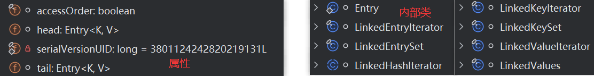
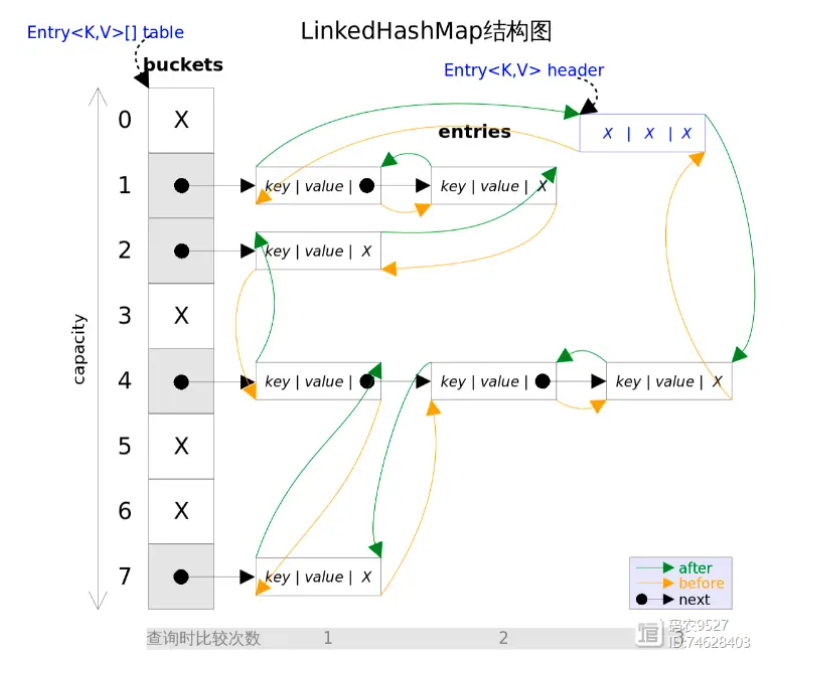

# JDK8中LinkedHashMap的源码分析





> LinkedHashMap 1.8 中的属性分析

```java
public class LinkedHashMap<K,V>
    extends HashMap<K,V>
    implements Map<K,V>
{
    // static class Entry<K,V> extends HashMap.Node<K,V> {
    //    Entry<K,V> before, after;
    //    Entry(int hash, K key, V value, Node<K,V> next) {
    //    	 super(hash, key, value, next);
    //    }
    // }
    private static final long serialVersionUID = 3801124242820219131L;
    transient LinkedHashMap.Entry<K,V> head;
    transient LinkedHashMap.Entry<K,V> tail;
    // 是否需要按访问顺序排序，如果为false则按插入顺序存储元素，如果是true则按访问顺序存储元素。
    final boolean accessOrder;
}
```

> LinkedHashMap 1.8 中的内部类

```java
```

> LinkedHashMap 1.8 中的构造方法分析

```java
// 
public LinkedHashMap() {
    super();
    accessOrder = false;
}
// 
public LinkedHashMap(int initialCapacity) {
    super(initialCapacity);
    accessOrder = false;
}
// 
public LinkedHashMap(int initialCapacity, float loadFactor) {
    super(initialCapacity, loadFactor);
    accessOrder = false;
}
//
public LinkedHashMap(int initialCapacity, float loadFactor, boolean accessOrder) {
    super(initialCapacity, loadFactor);
    this.accessOrder = accessOrder;
}
// 
public LinkedHashMap(Map<? extends K, ? extends V> m) {
    super();
    accessOrder = false;
    putMapEntries(m, false);
}
```

```java
final void putMapEntries(Map<? extends K, ? extends V> m, boolean evict) {
    int s = m.size();
    if (s > 0) {
        if (table == null) { // pre-size
            float ft = ((float)s / loadFactor) + 1.0F;
            int t = ((ft < (float)MAXIMUM_CAPACITY) ?
                     (int)ft : MAXIMUM_CAPACITY);
            if (t > threshold)
                threshold = tableSizeFor(t);
        }
        else if (s > threshold)
            resize();
        for (Map.Entry<? extends K, ? extends V> e : m.entrySet()) {
            K key = e.getKey();
            V value = e.getValue();
            putVal(hash(key), key, value, false, evict);
        }
    }
}
```


> ### 实例化过程

```java
00000000001    HashMap<String,Integer> map = new LinkedHashMap<>();
```

对应的源码：

```java
public HashMap() {
    this.loadFactor = DEFAULT_LOAD_FACTOR; // all other fields defaulted
}
```

**此时并没有初始化 hashMap 的初始容量，只初始化了影响影子；也没有创建 table[] 数组**

> **put(key,value)的过程**

```java
00000000002    map.put("AA",123);
```

对应的源码：


