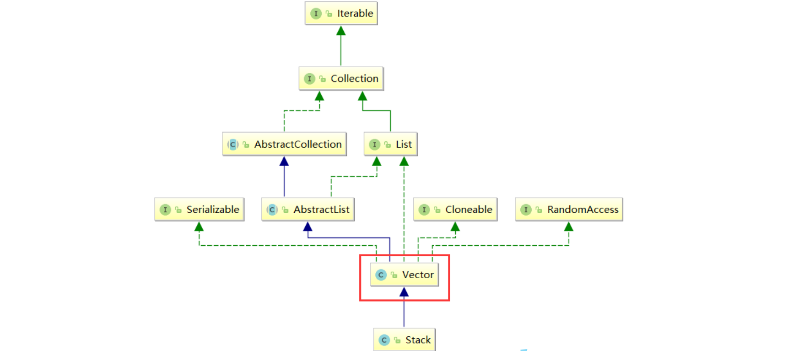
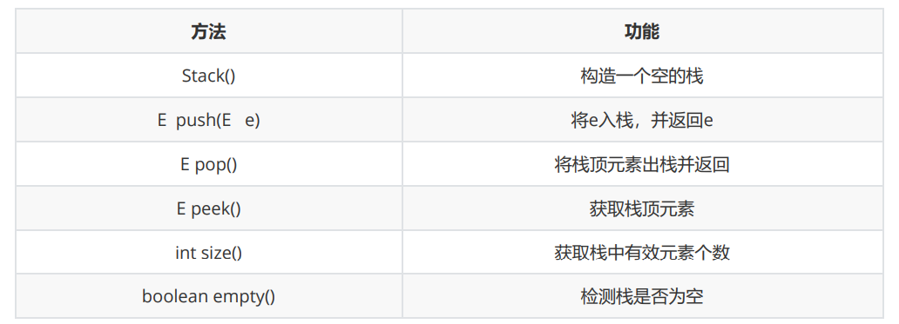

# stack源码1.8






****

```java
public class Stack<E> extends Vector<E> {

    public Stack() {
    }

    public E push(E item) {
        addElement(item);

        return item;
    }
===========================================================================
    public synchronized E pop() {
        E       obj;
        int     len = size();

        obj = peek();
        removeElementAt(len - 1);

        return obj;
    }
===========================================================================
    public synchronized E peek() {
        int     len = size();

        if (len == 0)
            throw new EmptyStackException();
        return elementAt(len - 1);
    }
===========================================================================
    public boolean empty() {
        return size() == 0;
    }
===========================================================================
    public synchronized int search(Object o) {
        int i = lastIndexOf(o);

        if (i >= 0) {
            return size() - i;
        }
        return -1;
    }
===========================================================================
    /** use serialVersionUID from JDK 1.0.2 for interoperability */
    @java.io.Serial
    private static final long serialVersionUID = 1224463164541339165L;
}
```

