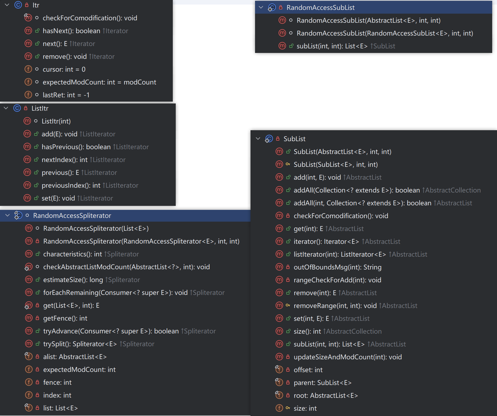
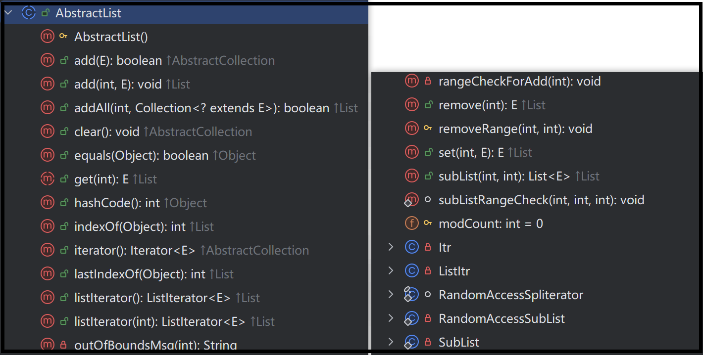

# AbstractList源码

> 属性分析

```java
public abstract class AbstractList<E> extends AbstractCollection<E> implements List<E> {
    protected transient int modCount = 0;
}
```

> 构造方法分析

```java
protected AbstractList() { }
```

> 内部类分析(实现)

```java
private class Itr implements Iterator<E> {......}
private class ListItr extends Itr implements ListIterator<E> {......}
static final class RandomAccessSpliterator<E> implements Spliterator<E> {......}
private static class RandomAccessSubList<E>
            extends SubList<E> implements RandomAccess {.....}
private static class SubList<E> extends AbstractList<E> {......}
```



> 方法分析(实现)

```java
```




