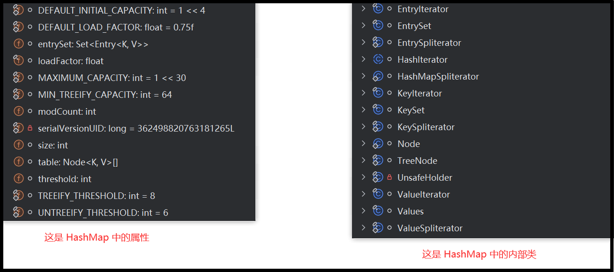

# Map源码

> HashMap 主要用来**存放键值对**，它**基于哈希表的 Map 接口实现**，是**常用的 Java 集合之一**，是**非线程安全**的

> `HashMap` 可以存储 null 的 key 和 value，但 null 作为键只能有一个，null 作为值可以有多个

JDK1.8 之前 HashMap 由 数组 + 单链表 组成的，数组是 HashMap 的主体，链表则是主要为了解决哈希冲突而存在的（“拉链法”解决冲突）。 JDK1.8 以后的 HashMap 在解决哈希冲突时有了较大的变化，当链表长度大于等于阈值（默认为 8）（将链表转换成红黑树前会判断，如果当前数组的长度小于 64，那么会选择先进行数组扩容，而不是转换为红黑树）时，将链表转化为红黑树，以减少搜索时间。


> `HashMap` 默认的**初始化大小为 16**。之后每次扩充，容量变为**原来的 2 倍**。并且， `HashMap` 总是**使用 2 的幂作为哈希表的大小**

------

JDK1.8 之前 HashMap 底层是 数组和单链表 结合在一起使用也就是 链表散列。

HashMap 通过 key 的 hashCode 经过扰动函数处理过后得到 hash 值，然后通过 (n - 1) & hash 判断当前元素存放的位置（这里的 n 指的是数组的长度），如果当前位置存在元素的话，就判断该元素与要存入的元素的 hash 值以及 key 是否相同，如果相同的话，直接覆盖，不相同就通过拉链法解决冲突。

所谓扰动函数指的就是 HashMap 的 hash 方法。使用 hash 方法也就是扰动函数是为了防止一些实现比较差的 hashCode() 方法 换句话说使用扰动函数之后可以减少碰撞。


```java
一、HashMap

1. HashMap中元素的特点
> HashMap中的所有的key彼此之间是不可重复的、无序的。所有的key就构成一个Set集合。--->key所在的类要重写hashCode()和equals()
> HashMap中的所有的value彼此之间是可重复的、无序的。所有的value就构成一个Collection集合。--->value所在的类要重写equals()
> HashMap中的一个key-value,就构成了一个entry。
> HashMap中的所有的entry彼此之间是不可重复的、无序的。所有的entry就构成了一个Set集合。


2. HashMap源码解析
2.1 jdk7中创建对象和添加数据过程(以JDK1.7.0_07为例说明)：

//创建对象的过程中，底层会初始化数组Entry[] table = new Entry[16];
HashMap<String,Integer> map = new HashMap<>();
...
map.put("AA",78); //"AA"和78封装到一个Entry对象中，考虑将此对象添加到table数组中。
...

添加/修改的过程：
将(key1,value1)添加到当前的map中：
首先，需要调用key1所在类的hashCode()方法，计算key1对应的哈希值1，此哈希值1经过某种算法(hash())之后，得到哈希值2。
哈希值2再经过某种算法(indexFor())之后，就确定了(key1,value1)在数组table中的索引位置i。
  1.1 如果此索引位置i的数组上没有元素，则(key1,value1)添加成功。  ---->情况1
  1.2 如果此索引位置i的数组上有元素(key2,value2),则需要继续比较key1和key2的哈希值2  --->哈希冲突
         2.1 如果key1的哈希值2与key2的哈希值2不相同，则(key1,value1)添加成功。   ---->情况2，return null
         2.2 如果key1的哈希值2与key2的哈希值2相同，则需要继续比较key1和key2的equals()。要调用key1所在类的equals(),将key2作为参数传递进去。
               3.1 调用equals()，返回false: 则(key1,value1)添加成功。   ---->情况3
               3.2 调用equals()，返回true: 则认为key1和key2是相同的。默认情况下，value1替换原有的value2。

说明：情况1：将(key1,value1)存放到数组的索引i的位置
     情况2,情况3：(key1,value1)元素与现有的(key2,value2)构成单向链表结构，(key1,value1)指向(key2,value2) return oldV

随着不断的添加元素，在满足如下的条件的情况下，会考虑扩容：
(size >= threshold) && (null != table[i])
当元素的个数达到临界值(-> 数组的长度 * 加载因子)时，就考虑扩容。默认的临界值 = 16 * 0.75 --> 12.
默认扩容为原来的2倍。


2.2 jdk8与jdk7的不同之处(以jdk1.8.0_271为例)：
① 在jdk8中，当我们创建了HashMap实例以后，底层并没有初始化table数组。当首次添加(key,value)时，进行判断，
如果发现table尚未初始化，则对数组进行初始化。
② 在jdk8中，HashMap底层定义了Node内部类，替换jdk7中的Entry内部类。意味着，我们创建的数组是Node[]
③ 在jdk8中，如果当前的(key,value)经过一系列判断之后，可以添加到当前的数组角标i中。如果此时角标i位置上有
   元素。在jdk7中是将新的(key,value)指向已有的旧的元素（头插法），而在jdk8中是旧的元素指向新的
   (key,value)元素（尾插法）。 "七上八下"
④ jdk7:数组+单向链表
   jk8:数组+单向链表 + 红黑树
   什么时候会使用单向链表变为红黑树：如果数组索引i位置上的元素的个数达到8，并且数组的长度达到64时，我们就将此索引i位置上
                               的多个元素改为使用红黑树的结构进行存储。（为什么修改呢？红黑树进行put()/get()/remove()
                               操作的时间复杂度为O(logn)，比单向链表的时间复杂度O(n)的好。性能更高。
   什么时候会使用红黑树变为单向链表：当使用红黑树的索引i位置上的元素的个数低于6的时候，就会将红黑树结构退化为单向链表。


2.3 属性/字段：
static final int DEFAULT_INITIAL_CAPACITY = 1 << 4; // 默认的初始容量 16
static final int MAXIMUM_CAPACITY = 1 << 30; //最大容量  1 << 30
static final float DEFAULT_LOAD_FACTOR = 0.75f;  //默认加载因子
static final int TREEIFY_THRESHOLD = 8; //默认树化阈值8，当链表的长度达到这个值后，要考虑树化
static final int UNTREEIFY_THRESHOLD = 6;//默认反树化阈值6，当树中结点的个数达到此阈值后，要考虑变为链表

//当单个的链表的结点个数达到8，并且table的长度达到64，才会树化。
//当单个的链表的结点个数达到8，但是table的长度未达到64，会先扩容
static final int MIN_TREEIFY_CAPACITY = 64; //最小树化容量64

transient Node<K,V>[] table; //数组
transient int size;  //记录有效映射关系的对数，也是Entry对象的个数
int threshold; //阈值，当size达到阈值时，考虑扩容
final float loadFactor; //加载因子，影响扩容的频率


二、LinkedHashMap
1. LinkedHashMap 与 HashMap 的关系:
> LinkedHashMap 是 HashMap的子类。
> LinkedHashMap在HashMap使用的数组+单向链表+红黑树的基础上，又增加了一对双向链表，记录添加的(key,value)的
先后顺序。便于我们遍历所有的key-value。

LinkedHashMap重写了HashMap的如下方法：
Node<K,V> newNode(int hash, K key, V value, Node<K,V> e) {
    LinkedHashMap.Entry<K,V> p = new LinkedHashMap.Entry<K,V>(hash, key, value, e);
    linkNodeLast(p);
    return p;
}


2. 底层结构：LinkedHashMap内部定义了一个Entry
static class Entry<K,V> extends HashMap.Node<K,V> {
    Entry<K,V> before, after; //增加的一对双向链表
    Entry(int hash, K key, V value, Node<K,V> next) {
        super(hash, key, value, next);
    }
}

三、HashSet和LinkedHashSet的源码分析
> HashSet底层使用的是HashMap
> LinkedHashSet底层使用的是LinkedHashMap
```


> HashMap中jdk1.7的属性

```java

```

> HashMap中jdk1.7的内部类

```java
static class Entry<K,V> implements Map.Entry<K,V> {
    final K key;
    V value;
    Entry<K,V> next;
    int hash;

    Entry(int h, K k, V v, Entry<K,V> n) {
        value = v;
        next = n;
        key = k;
        hash = h;
    }

    public final K getKey() {
        return key;
    }

    public final V getValue() {
        return value;
    }

    public final V setValue(V newValue) {
        V oldValue = value;
        value = newValue;
        return oldValue;
    }

    public final boolean equals(Object o) {
        if (!(o instanceof Map.Entry))
            return false;
        Map.Entry e = (Map.Entry)o;
        Object k1 = getKey();
        Object k2 = e.getKey();
        if (k1 == k2 || (k1 != null && k1.equals(k2))) {
            Object v1 = getValue();
            Object v2 = e.getValue();
            if (v1 == v2 || (v1 != null && v1.equals(v2)))
                return true;
        }
        return false;
    }

    public final int hashCode() {
        return (key==null   ? 0 : key.hashCode()) ^
            (value==null ? 0 : value.hashCode());
    }

    public final String toString() {
        return getKey() + "=" + getValue();
    }

    void recordAccess(HashMap<K,V> m) {
    }

    void recordRemoval(HashMap<K,V> m) {
    }
}
=====================================================================
private final class EntrySet extends AbstractSet<Map.Entry<K,V>> {
    public Iterator<Map.Entry<K,V>> iterator() {
        return newEntryIterator();
    }
    public boolean contains(Object o) {
        if (!(o instanceof Map.Entry))
            return false;
        Map.Entry<K,V> e = (Map.Entry<K,V>) o;
        Entry<K,V> candidate = getEntry(e.getKey());
        return candidate != null && candidate.equals(e);
    }
    public boolean remove(Object o) {
        return removeMapping(o) != null;
    }
    public int size() {
        return size;
    }
    public void clear() {
        HashMap.this.clear();
    }
}
=====================================================================
private final class EntryIterator extends HashIterator<Map.Entry<K,V>> {
    public Map.Entry<K,V> next() {
    	return nextEntry();
    }
}
=====================================================================
 private abstract class HashIterator<E> implements Iterator<E> {
     Entry<K,V> next;        // next entry to return
     int expectedModCount;   // For fast-fail
     int index;              // current slot
     Entry<K,V> current;     // current entry

     HashIterator() {
         expectedModCount = modCount;
         if (size > 0) { // advance to first entry
             Entry[] t = table;
             while (index < t.length && (next = t[index++]) == null)
                 ;
         }
     }

     public final boolean hasNext() {
         return next != null;
     }

     final Entry<K,V> nextEntry() {
         if (modCount != expectedModCount)
             throw new ConcurrentModificationException();
         Entry<K,V> e = next;
         if (e == null)
             throw new NoSuchElementException();

         if ((next = e.next) == null) {
             Entry[] t = table;
             while (index < t.length && (next = t[index++]) == null)
                 ;
         }
         current = e;
         return e;
     }

     public void remove() {
         if (current == null)
             throw new IllegalStateException();
         if (modCount != expectedModCount)
             throw new ConcurrentModificationException();
         Object k = current.key;
         current = null;
         HashMap.this.removeEntryForKey(k);
         expectedModCount = modCount;
     }
 }
=====================================================================

```




> HashMap 中的属性

```java
public class HashMap<K,V> extends AbstractMap<K,V> implements Map<K,V>, Cloneable, Serializable {
    // 序列号
    private static final long serialVersionUID = 362498820763181265L;
    // 默认的初始容量是16
    static final int DEFAULT_INITIAL_CAPACITY = 1 << 4;
    // 最大容量
    static final int MAXIMUM_CAPACITY = 1 << 30;
    // 默认的负载因子
    static final float DEFAULT_LOAD_FACTOR = 0.75f;
    // 当桶(bucket)上的结点数大于等于这个值时会转成红黑树
    static final int TREEIFY_THRESHOLD = 8;
    // 当桶(bucket)上的结点数小于等于这个值时树转链表
    static final int UNTREEIFY_THRESHOLD = 6;
    // 桶中结构转化为红黑树对应的table的最小容量
    static final int MIN_TREEIFY_CAPACITY = 64;
    
    // 存储元素的数组，总是2的幂次倍
    transient Node<k,v>[] table;
    // 存放具体元素的集
    transient Set<map.entry<k,v>> entrySet;
    
    // 存放元素的个数，注意这个不等于数组的长度。
    transient int size;
    // 每次扩容和更改map结构的计数器
    transient int modCount;
    // 阈值(容量*负载因子) 当实际大小超过阈值时，会进行扩容
    int threshold;
    // 负载因子
    final float loadFactor;
}
```

> map 中的内部类

```java
interface Entry<K,V> {
    K getKey();
    V getValue();
    V setValue(V value);
    boolean equals(Object o);
    int hashCode();
    public static <K extends Comparable<? super K>, V> Comparator<Map.Entry<K,V>> comparingByKey() {
        return (Comparator<Map.Entry<K, V>> & Serializable)
            (c1, c2) -> c1.getKey().compareTo(c2.getKey());
    }
    public static <K, V extends Comparable<? super V>> Comparator<Map.Entry<K,V>> comparingByValue() {
        return (Comparator<Map.Entry<K, V>> & Serializable)
            (c1, c2) -> c1.getValue().compareTo(c2.getValue());
    }
    public static <K, V> Comparator<Map.Entry<K, V>> comparingByKey(Comparator<? super K> cmp) {
        Objects.requireNonNull(cmp);
        return (Comparator<Map.Entry<K, V>> & Serializable)
            (c1, c2) -> cmp.compare(c1.getKey(), c2.getKey());
    }
    public static <K, V> Comparator<Map.Entry<K, V>> comparingByValue(Comparator<? super V> cmp) {
        Objects.requireNonNull(cmp);
        return (Comparator<Map.Entry<K, V>> & Serializable)
            (c1, c2) -> cmp.compare(c1.getValue(), c2.getValue());
    }
}
```

HashMap 中的内部类别

```java
static class Node<K,V> implements Map.Entry<K,V> {
    final int hash;
    final K key;
    V value;
    Node<K,V> next;
    
    Node(int hash, K key, V value, Node<K,V> next) {
        this.hash = hash;
        this.key = key;
        this.value = value;
        this.next = next;
    }
    
    public final K getKey()        { return key; }
    public final V getValue()      { return value; }
    public final String toString() { return key + "=" + value; }

    public final int hashCode() {
        return Objects.hashCode(key) ^ Objects.hashCode(value);
    }

    public final V setValue(V newValue) {
        V oldValue = value;
        value = newValue;
        return oldValue;
    }

    public final boolean equals(Object o) {
        if (o == this)
            return true;
        if (o instanceof Map.Entry) {
            Map.Entry<?,?> e = (Map.Entry<?,?>)o;
            if (Objects.equals(key, e.getKey()) &&
                Objects.equals(value, e.getValue()))
                return true;
        }
        return false;
    }
}

========================================================================================
    
static class Entry<K,V> implements Map.Entry<K,V> {
        final K key;
        V value;
        Entry<K,V> next;
        int hash;

        Entry(int h, K k, V v, Entry<K,V> n) {
            value = v;
            next = n;
            key = k;
            hash = h;
        }

        public final K getKey() {
            return key;
        }

        public final V getValue() {
            return value;
        }

        public final V setValue(V newValue) {
            V oldValue = value;
            value = newValue;
            return oldValue;
        }

        public final boolean equals(Object o) {
            if (!(o instanceof Map.Entry))
                return false;
            Map.Entry e = (Map.Entry)o;
            Object k1 = getKey();
            Object k2 = e.getKey();
            if (k1 == k2 || (k1 != null && k1.equals(k2))) {
                Object v1 = getValue();
                Object v2 = e.getValue();
                if (v1 == v2 || (v1 != null && v1.equals(v2)))
                    return true;
            }
            return false;
        }

        public final int hashCode() {
            return (key==null   ? 0 : key.hashCode()) ^
                   (value==null ? 0 : value.hashCode());
        }

        public final String toString() {
            return getKey() + "=" + getValue();
        }

        void recordAccess(HashMap<K,V> m) {
        }

        void recordRemoval(HashMap<K,V> m) {
        }
    }
```


> HashMap中的构造方法

```java
// 空构造器构造一个具有默认初始容量 （16） 和默认负载因子 （0.75） 的空 HashMap。
public HashMap() {
    this.loadFactor = DEFAULT_LOAD_FACTOR; // all other fields defaulted
}
=========================================================================================
// 
public HashMap(Map<? extends K, ? extends V> m) {
    this.loadFactor = DEFAULT_LOAD_FACTOR;
    putMapEntries(m, false);
}
=========================================================================================
// 
public HashMap(int initialCapacity, float loadFactor) {
    if (initialCapacity < 0)
        throw new IllegalArgumentException("Illegal initial capacity: " +
                                           initialCapacity);
    if (initialCapacity > MAXIMUM_CAPACITY)
        initialCapacity = MAXIMUM_CAPACITY;
    if (loadFactor <= 0 || Float.isNaN(loadFactor))
        throw new IllegalArgumentException("Illegal load factor: " +
                                           loadFactor);
    this.loadFactor = loadFactor;
    this.threshold = tableSizeFor(initialCapacity);
}
=========================================================================================
// 
public HashMap(int initialCapacity) {
	this(initialCapacity, DEFAULT_LOAD_FACTOR);
}
```


