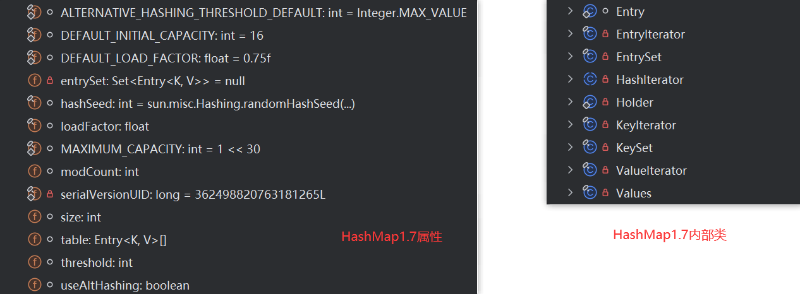
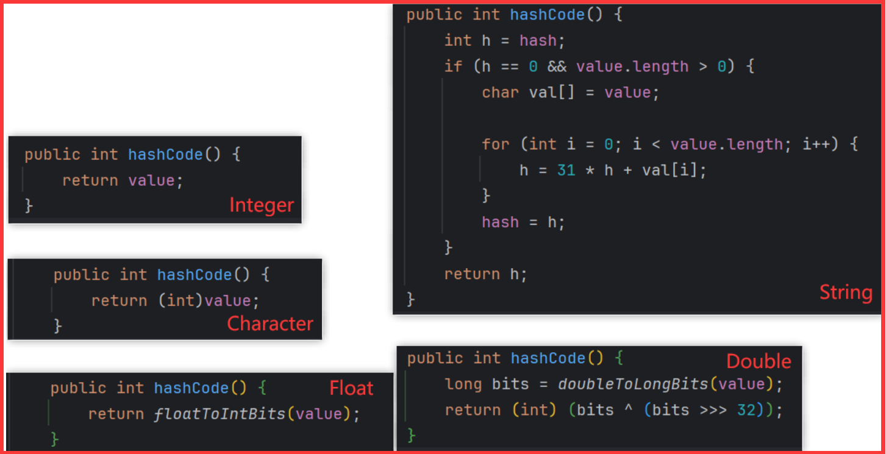

## JDK7中的HashMap的源码

#### 1. 实例化过程

```java
HashMap<String,Integer> map = new HashMap<>();
```

对应的源码：

```java
public HashMap() {
    this(DEFAULT_INITIAL_CAPACITY, DEFAULT_LOAD_FACTOR);
}
public HashMap(int initialCapacity, float loadFactor) {
    //...略...

    //通过此循环，得到capacity的最终值，此最终值决定了Entry数组的长度。此时的capacity一定是2的整数倍
    int capacity = 1;
    while (capacity < initialCapacity)
        capacity <<= 1;

    this.loadFactor = loadFactor; //确定了加载因子的值
    threshold = (int)Math.min(capacity * loadFactor, MAXIMUM_CAPACITY + 1);  //确定了临界值
    table = new Entry[capacity]; //初始化数组，长度为capacity
    
    //..略..
}
```

其中：

```java
static final int DEFAULT_INITIAL_CAPACITY = 16;
static final float DEFAULT_LOAD_FACTOR = 0.75f;

final float loadFactor; //加载因子
int threshold;//临界值
transient Entry<K,V>[] table; //存储数组的数组
```

#### 2. put(key,value)的过程

```java
public V put(K key, V value) {
    //HashMap允许添加key为null的值。将此(key,value)存放到table索引0的位置。
    if (key == null)
        return putForNullKey(value);
    //将key传入hash()，内部使用了key的哈希值1，此方法执行结束后，返回哈希值2
    int hash = hash(key);
    //确定当前key，value在数组中的存放位置i
    int i = indexFor(hash, table.length);
    
    for (Entry<K,V> e = table[i]; e != null; e = e.next) {
        Object k;
        if (e.hash == hash && ((k = e.key) == key || key.equals(k))) {
            V oldValue = e.value;
            e.value = value;
            e.recordAccess(this);
            return oldValue;  //如果put是修改操作，会返回原有旧的value值。
        }
    }

    //.....
    addEntry(hash, key, value, i); //将key,value封装为一个Entry对象，并将此对象保存在索引i位置。
    return null; //如果put是添加操作，会返回null.
}
```

其中：

```java
final int hash(Object k) {
    int h = 0;
    if (useAltHashing) {
        if (k instanceof String) {
            return sun.misc.Hashing.stringHash32((String) k);
        }
        h = hashSeed;
    }

    h ^= k.hashCode();

    // This function ensures that hashCodes that differ only by
    // constant multiples at each bit position have a bounded
    // number of collisions (approximately 8 at default load factor).
    h ^= (h >>> 20) ^ (h >>> 12);
    return h ^ (h >>> 7) ^ (h >>> 4);
}
static int indexFor(int h, int length) {
    return h & (length-1);
}
void addEntry(int hash, K key, V value, int bucketIndex) {
    //扩容的条件
    if ((size >= threshold) && (null != table[bucketIndex])) {
        resize(2 * table.length); //默认扩容为原有容量的2倍
        hash = (null != key) ? hash(key) : 0;
        bucketIndex = indexFor(hash, table.length);
    }

    createEntry(hash, key, value, bucketIndex);
}
void createEntry(int hash, K key, V value, int bucketIndex) {
    Entry<K,V> e = table[bucketIndex];
    table[bucketIndex] = new Entry<>(hash, key, value, e);
    size++;
}
```

#### 3. Entry的定义如下：

```java
static class Entry<K,V> implements Map.Entry<K,V> {
    final K key;
    V value;
    Entry<K,V> next;
    int hash;  //使用key得到的哈希值2进行赋值。

    /**
         * Creates new entry.
         */
    Entry(int h, K k, V v, Entry<K,V> n) {
        value = v;
        next = n;
        key = k;
        hash = h;
    }
}
```




> HashMap中jdk1.7的属性

```java
public class HashMap<K,V>
    extends AbstractMap<K,V>
    implements Map<K,V>, Cloneable, Serializable
{
    static final int ALTERNATIVE_HASHING_THRESHOLD_DEFAULT = Integer.MAX_VALUE;// 
    static final int DEFAULT_INITIAL_CAPACITY = 16;//默认初始化化容量,即16  
    static final float DEFAULT_LOAD_FACTOR = 0.75f;//默认装载因子  
    private transient Set<Map.Entry<K,V>> entrySet = null;//空的存储实体  
    transient final int hashSeed = sun.misc.Hashing.randomHashSeed(this);
    final float loadFactor;//负载因子，代表了table的填充度有多少，默认是0.75
    static final int MAXIMUM_CAPACITY = 1 << 30;//最大容量，即2的30次方  1073741824
    transient int modCount;
    private static final long serialVersionUID = 362498820763181265L;
    transient int size;//实际存储的key-value键值对的个数
    transient Entry<K,V>[] table;//HashMap内部的存储结构是一个数组，此处数组为null，即没有初始化之前的状态  
    int threshold;//阈值，当table == {}时，该值为初始容量（初始容量默认为16）；当table被填充了，也就是为table分配内存空间					  后，threshold一般为 capacity*loadFactory。HashMap在进行扩容时需要参考threshold
    transient boolean useAltHashing;
}
```

> HashMap中jdk1.7的内部类

```java
static class Entry<K,V> implements Map.Entry<K,V> {
    final K key;
    V value;
    Entry<K,V> next;
    int hash;

    Entry(int h, K k, V v, Entry<K,V> n) {
        value = v;
        next = n;
        key = k;
        hash = h;
    }
    public final K getKey() {}
    public final V getValue() {}
    public final V setValue(V newValue) {}
    public final boolean equals(Object o) {}
    public final int hashCode() {}
    public final String toString() {}
    
```

> HashMap中jdk1.7的构造方法
>

```java
// 空参构造
public HashMap() {
    this(DEFAULT_INITIAL_CAPACITY, DEFAULT_LOAD_FACTOR); // default(默认初始化容量 16, 默认负载因子 0.75f)
}

// 
public HashMap(int initialCapacity) {
    this(initialCapacity, DEFAULT_LOAD_FACTOR); // default(initialCapacity，0.75f)
}

// 
public HashMap(int initialCapacity, float loadFactor) {
    // 进行参数判断，若自定义的初始化容量 < 0，报异常
    if (initialCapacity < 0)
        throw new IllegalArgumentException("Illegal initial capacity: " + initialCapacity);
    // 如果自定义的初始化容量大于最大值 1 << 30，则 initialCapacity = MAXIMUM_CAPACITY
    if (initialCapacity > MAXIMUM_CAPACITY)
        initialCapacity = MAXIMUM_CAPACITY;
    // 如果自定义的 影响因子小于等于0或者不是一个数字，则报出异常
    if (loadFactor <= 0 || Float.isNaN(loadFactor))
        throw new IllegalArgumentException("Illegal load factor: " +
                                           loadFactor);

    // Find a power of 2 >= initialCapacity : 找到一个2的次方幂 >= 自定义的容量或者默认容量
    我们在这里去找到一个大于等于传入的容量的，且是2的整数幂的容量
    int capacity = 1;
    while (capacity < initialCapacity)
        capacity <<= 1;

    this.loadFactor = loadFactor;
    // 阈值的选取是选取 min(容量*影响因子，最大容量 + 1)
    threshold = (int) Math.min(capacity * loadFactor, MAXIMUM_CAPACITY + 1);
    // 在这里对数组 table[] 进行初始化
    table = new Entry[capacity];
    useAltHashing = sun.misc.VM.isBooted() &&
        (capacity >= Holder.ALTERNATIVE_HASHING_THRESHOLD);
    init();
}
void init() {} 啥都没做
    
// 
public HashMap(Map<? extends K, ? extends V> m) {
    this(Math.max((int) (m.size() / DEFAULT_LOAD_FACTOR) + 1,
                  DEFAULT_INITIAL_CAPACITY), DEFAULT_LOAD_FACTOR);
    putAllForCreate(m);
}
```


> ### 实例化过程
>

```java
00000000001    HashMap<String,Integer> map = new HashMap<>();
```

对应的源码：

```java
public HashMap() {
    this(DEFAULT_INITIAL_CAPACITY, DEFAULT_LOAD_FACTOR); // default(默认初始化容量 16, 默认负载因子 0.75f)
}
public HashMap(int initialCapacity, float loadFactor) {
    //...略...

    //通过此循环，得到capacity的最终值，此最终值决定了Entry数组的长度。此时的capacity一定是2的整数倍
    int capacity = 1;
    while (capacity < initialCapacity)
        capacity <<= 1;

    this.loadFactor = loadFactor; //确定了加载因子的值
    threshold = (int) Math.min(capacity * loadFactor, MAXIMUM_CAPACITY + 1);  //确定了临界值
    table = new Entry[capacity]; //初始化数组，长度为capacity
    
    //..略..
}
```

**此时已经初始化了 hashMap 的初始容量和 影响影子 已经创建了 table[] 数组**

> **put(key,value)的过程**

```java
00000000002    map.put("AA",123);
```

对应的源码：

```java
public V put(K key, V value) {
    if (key == null)
        // 如果key的值为null，则放置在table数组的下标为0的位置(即如果key为null，存储位置为table[0]或table[0]的冲突链上)
        return putForNullKey(value);
    
    int hash = hash(key); // 计算哈希值2
    int i = indexFor(hash, table.length); // 计算该哈希值2对应的索引
    // 取出对应索引处的entry，如果entry是null，就直接将（key , value）放在该索引处
    // 取出对应索引处的entry，如果entry不是null，就对比其哈希值2，如果两个entry的哈希值2相等并且key值也相等。就value覆盖
       entry.hash 中的hash其实就是entry中的key值计算出来的哈希值2
    // 取出对应索引处的entry，如果entry不是null，并且两个entry的哈希值2不相等 或者 key值不相等，啥也不做，顺着链表往下找
    // 如果中途找到全相等的了，就覆盖然后结束，否则直接链在找到的最后一个 entry 链表的前面再结束
    for (Entry<K,V> e = table[i]; e != null; e = e.next) {
        Object k;
        if (e.hash == hash && ((k = e.key) == key || key.equals(k))) {
            V oldValue = e.value;
            e.value = value; 
            e.recordAccess(this);
            return oldValue;
        }
    }

    // 此处有两种情况，第一种是该索引处的 entry 为 null，就直接在该索引位置添加元素结束
    // 第二种是便利完成该索引处链表的所有元素，没有找到 hash2 和 key值都相等的元素，也是直接链在最后一个entry链表的前面再结束
    modCount++;
    addEntry(hash, key, value, i);
    return null;
}
```

```java
private V putForNullKey(V value) {
    // 把 table 数组的下标为0的位置的元素取出来，如果其 entry 不为 null并且entry的key是null，那么就用新值换旧值结束
    // 如果entry不为null但是entry的key也不为null，就按着链表顺序往下找，如果找到某一个entry的key为null,就替换,找不到就直接     // 链在前面
    for (Entry<K,V> e = table[0]; e != null; e = e.next) {
        // 在这里 e != null
        if (e.key == null) {
            // 新的 value 替换旧的 value，return oldValue
            V oldValue = e.value;
            e.value = value;
            e.recordAccess(this);     // void recordAccess(HashMap<K,V> m) {}
            return oldValue;
        }
    }
    // 在这里 entry = null，就是下标为 0 的位置 entry = null
    // 或者 entry 不为 null，但是顺着链表找到最后也没有找到某一个 entry 的 key 为 null
    // 这两种情况就把 entry(null-value) 链在前面
    modCount++;
    addEntry(0, null, value, 0);
    return null;
}
```

```java
// bucketIndex 就是哈希值2经过indexFor()计算出来的存放在数组中的位置下标(索引)
void addEntry(int hash, K key, V value, int bucketIndex) {  // (0, null, value, 0)
    // 如果元素的数量已经大于 阈值，并且此时计算出来的 bucketIndex 下标位置的 entry 不是 null ==>> 扩容 2 倍
    if ((size >= threshold) && (null != table[bucketIndex])) {
        resize(2 * table.length);
        // 重新计算哈希值2
        hash = (null != key) ? hash(key) : 0;
        // 重新计算 bucketIndex
        bucketIndex = indexFor(hash, table.length);
    }
    // 不扩容的话，直接就在该 bucketIndex 下标处添加 entry
    // 扩容的话就重新计算 bucketIndex, 然后在该位置添加 entry
    createEntry(hash, key, value, bucketIndex);
}
```

```java
// 此方法是在添加元素的时候，给 hashMap 进行扩容的行为
void resize(int newCapacit) {  // 传过来的参数是 2 * table.length
    Entry[] oldTable = table;
    int oldCapacity = oldTable.length;
    if (oldCapacity == MAXIMUM_CAPACITY) {   // 1 << 30 : 1073741824
        threshold = Integer.MAX_VALUE;       // 0x7fffffff : 2,147,483,647
        return;
    }

    Entry[] newTable = new Entry[newCapacity];
    boolean oldAltHashing = useAltHashing;
    useAltHashing |= sun.misc.VM.isBooted() && (newCapacity >= Holder.ALTERNATIVE_HASHING_THRESHOLD);
    boolean rehash = oldAltHashing ^ useAltHashing;
    transfer(newTable, rehash);
    table = newTable;
    threshold = (int)Math.min(newCapacity * loadFactor, MAXIMUM_CAPACITY + 1);
}
```

```java
static int indexFor(int h, int length) {  // hash2 & (table.length -1)
    return h & (length-1);
}
```


```java
// 
void createEntry(int hash, K key, V value, int bucketIndex) {
    Entry<K,V> e = table[bucketIndex];
    table[bucketIndex] = new Entry<>(hash, key, value, e);  // e is "entry<> next"
    size++;
}
```


------

# hash 值的计算方法

```java
HashMap 通过 key 的 hashCode 经过扰动函数处理过后得到 hash 值，然后通过 (n - 1) & hash 判断当前元素存放的位置（这里的 n 指的是数组的长度），如果当前位置存在元素的话，就判断该元素与要存入的元素的 hash 值以及 key 是否相同，如果相同的话，直接覆盖，不相同就通过拉链法解决冲突。
所谓扰动函数指的就是 HashMap 的 hash 方法。使用 hash 方法也就是扰动函数是为了防止一些实现比较差的 hashCode() 方法 换句话说使用扰动函数之后可以减少碰撞。
// HashMap 中的 hash() 方法
final int hash(Object k) {
    int h = 0;
    if (useAltHashing) {
        if (k instanceof String) {
            return sun.misc.Hashing.stringHash32((String) k);
        }
        h = hashSeed;
    }

    h ^= k.hashCode(); // 计算哈希值1

    // This function ensures that hashCodes that differ only by
    // constant multiples at each bit position have a bounded
    // number of collisions (approximately 8 at default load factor).
    // 计算哈希值2
    h ^= (h >>> 20) ^ (h >>> 12);
    return h ^ (h >>> 7) ^ (h >>> 4);
}
```

```java
// 例如 String 中的 hashCode()方法     value[] 存储 字符串
public int hashCode() {
    int h = hash;
    if (h == 0 && value.length > 0) {
        char val[] = value;

        for (int i = 0; i < value.length; i++) {
            h = 31 * h + val[i];
        }
        hash = h;
    }
    return h;
}

// Object 中的 hashCode()方法
public static int hashCode(Object o) {
    return o != null ? o.hashCode() : 0;
}
// 自定义的类的 hashCode()方法(以student类为例，其有两个属性age name)
@Override
public int hashCode() {
    return Objects.hash(age, name);
}

// Object 中的 hash()方法
public static int hash(Object... values) {
    return Arrays.hashCode(values);
}
// Arrays 类的 hashCode()方法
public static int hashCode(Object a[]) {
    if (a == null)
        return 0;

    int result = 1;

    for (Object element : a)
        result = 31 * result + (element == null ? 0 : element.hashCode());

    return result;
}
```




> HashMap 中的常用类
>

```java
```


