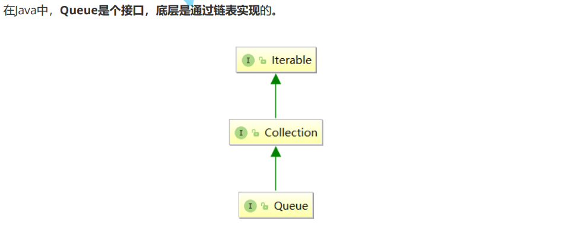
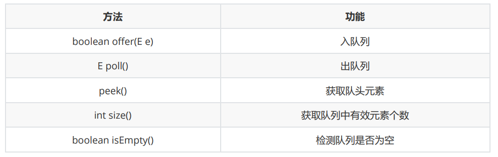

# queue1.8





```java
public interface Queue<E> extends Collection<E> {
    
    boolean add(E e);

    boolean offer(E e);

    E remove();

    E poll();

    E element();

    E peek();
}
```

